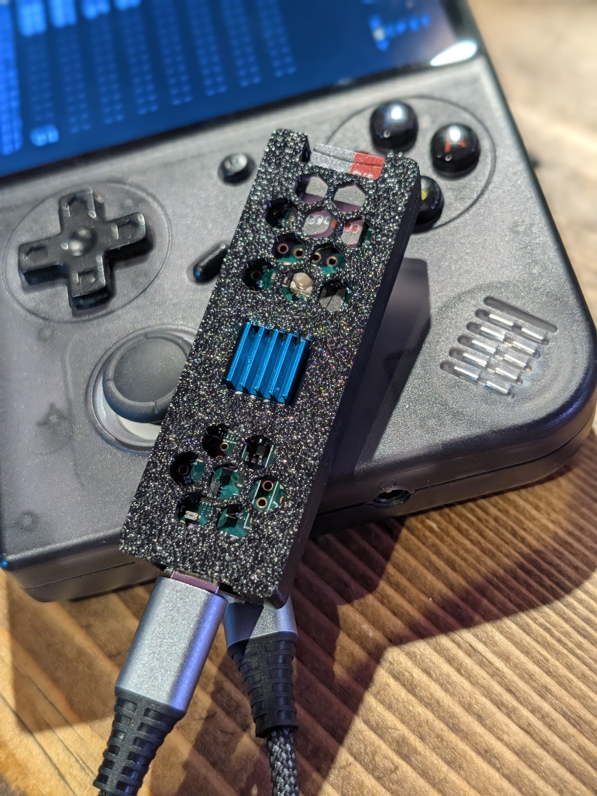

# m8c-headless-handheld

This repo is a collection of the helpful resources i have pulled together when setting up my [DirtyWave M8](https://dirtywave.com/) **headless** client
([m8c](https://github.com/laamaa/m8c)) on Linux retro handhelds - builds, printable
**controller cheat sheets**, and setup docs. Aimed at Allwinner **H700** devices
(RG35XX* / RG40XX*) running **muOS** or **Knulli**, but much of it is device-agnostic.

In some instances i have collated other resources or re-written them to suit my needs; credit is given where its due, my only aim was to ensure i didn't lose the information and to share it with others.

The links below will take you to the relevant resources. Note that some are WIP or potentially dumping grounds depending where I'm at with documenting things.

## Contents

| Area | What's here |
|------|-------------|
| [🔨 Build](#-build) | Compile `m8c` + the kernel modules for the handheld |
| [🎛️ Cheat sheets](#️-cheat-sheets) | Personalised, printable M8 shortcut cards (+ a web generator) |
| [📚 Docs](#-docs) | Setup & troubleshooting guides |
| [🧰 3D Prints](#-3d-prints) | Teensy4.1 case & device mounts |

---

## 🔨 Build

> ⚠️ **Work in progress - being reworked.**

The Docker-based build (Linux kernel modules + `m8c` for the Allwinner H700) lives at
the repo root: `build.sh`, `Dockerfile.arm64`, `Dockerfile.x86_64`, `build_script.*.sh`.
Run `./build.sh` locally (Docker required), or use the cloud build below - both produce
identical output, since the cloud build just runs this same script.

The build is based on **[jamesMcMeex/m8c-rg35xx-knulli](https://github.com/jamesMcMeex/m8c-rg35xx-knulli)**,
see their repo for the original Docker build instructions.

The aim here is to take the good work jamesMcMeex has done with his docker compile and move it into something anyone can do without any local setup. The current handheld port is fixed to version 1.7 - this is due to newer versions of the M8C migrating to a new SD3 engine.
There is a test build i have partly working on the H700 devices (see [`docs/sdl3-westonpack-notes.md`](docs/sdl3-westonpack-notes.md)).

### ☁️ Cloud build

No local setup needed - **[Actions → Build m8c → Run workflow](../../actions/workflows/build-m8c.yml)**
compiles a fresh v1.7.10 (or any version you type in) the same way `./build.sh` does. It's manual
only (builds are infrequent), and every run stages the Knulli + muOS packages as a downloadable
**Artifact** for testing on-device first. Once a build checks out, re-run it with
**"Also publish a GitHub Release"** ticked to cut a [Release](../../releases) with the same files
attached - see [`docs/install.md`](docs/install.md) for where each file goes.

Once the SDL3/v2.x path is fully working, this can switch to auto-building each new
`laamaa/m8c` release as it ships.

## 🎛️ Cheat sheets

Printable M8 shortcut references, adapted so the button icons show **your handheld's buttons**
while the wording keeps the M8's own names (so they still match the Dirtywave manual).

### ▶ [Open the cheat-sheet generator](https://null-rot.github.io/m8c-headless-handheld/cheatsheets/generator/)

Pick which button each M8 function sits on, watch a live preview, then Print / Save PDF.
Choose single-page or fold booklet, US Letter or A4, and your device's button legend.

Or print a ready-made copy (stock mapping):
- [Single-page card](https://null-rot.github.io/m8c-headless-handheld/cheatsheets/shortcuts-controller.html) (firmware 6.5+, landscape)
- [Pocket fold booklet](https://null-rot.github.io/m8c-headless-handheld/cheatsheets/controller.html)
- [EFX & synthesis reference](https://null-rot.github.io/m8c-headless-handheld/cheatsheets/efx.html)

### The original M8 guides these are based on

These are controller-adapted derivatives of two great guides for the standard M8 - go grab the
originals (and give them a star):
- **[LaurentVitalis/M8Guide](https://github.com/LaurentVitalis/M8Guide)** - the fold booklet and the SVG button-pad design.
- **[cengebretson/M8Guide](https://github.com/cengebretson/M8Guide)** - the single-page layout and the firmware 6.5+ shortcut set / EFX reference.

The M8 tracker is a product of [Dirtywave](https://dirtywave.com/); `m8c` is by
[laamaa](https://github.com/laamaa/m8c).

## 📚 Docs

Setup and troubleshooting guides live in [`docs/`](docs) - start with
[`install.md`](docs/install.md) for where to put each file on muOS/Knulli, controls, and
common fixes.

## 🧰 3D Prints

  

STLs and print notes for the Teensy 4.1 case and device mounts live in
[`3d-prints/`](3d-prints).

---

## Acknowledgments
- [Dirtywave](https://dirtywave.com/) - the M8 tracker.
- [laamaa](https://github.com/laamaa/m8c) - the `m8c` headless client.
- [jamesMcMeex](https://github.com/jamesMcMeex/m8c-rg35xx-knulli) - the H700 build this started from.
- [LaurentVitalis](https://github.com/LaurentVitalis/M8Guide) & [cengebretson](https://github.com/cengebretson/M8Guide) - the M8 shortcut guides.
- The Knulli & muOS communities.
